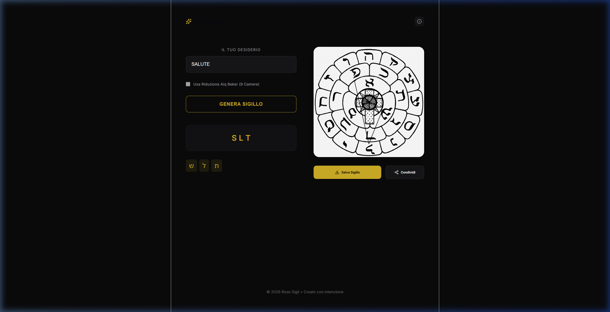
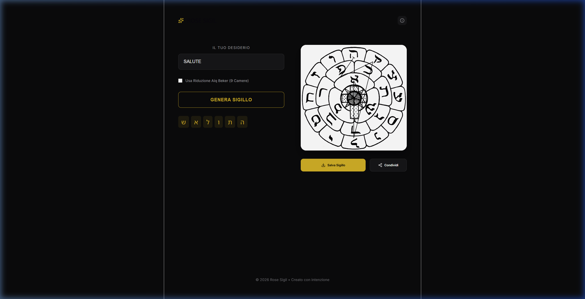

# 🌹 Rose Sigil Creation App

A high-fidelity web application for generating esoteric sigils using the traditional **Golden Dawn Rose Cross** technique. This tool bridges ancient ceremonial magic with modern digital precision, offering a ritualistic and aesthetically premium experience.

## 🌒 Overview

**Rose Sigil** is a specialized tool for practitioners and researchers of the Western Esoteric Tradition. It automates the complex process of alchemical letter reduction and transliteration, tracing a golden path over the 22-petal Rose Cross to manifest a unique sigil based on your intent.

## ✨ Key Features

- **Obsidian & Gold Aesthetics**: A premium, minimalist design inspired by ancient grimoires.
- **Ritual Animation Engine**: Real-time visualization of vowel removal and character reduction.
- **Dynamic Tracing**: A smooth, glowing golden path drawn slowly to simulate a ritual act.
- **Transparent Export**: High-quality PNG export for use in digital or physical ritual documents.
- **Responsive Design**: Optimized for both high-end desktops and mobile devices.

## 📜 The Technique

The application follows the sacred method of the Golden Dawn:
1. **Intention**: Your desire is entered and distilled.
2. **Reduction**: Non-essential vowels and duplicate letters are removed.
3. **Transliteration**: The core essence is mapped to the Hebrew alphabet.
4. **Tracing**: The sigil is drawn starting with a circle and ending with a grounding T-bar.

## 🛠 Tech Stack

- **Framework**: React + Vite
- **Animations**: Framer Motion
- **Rendering**: HTML5 Canvas API
- **Typography**: Cormorant Garamond & Inter

---
*Created with intention by Rose Sigil © 2026*
